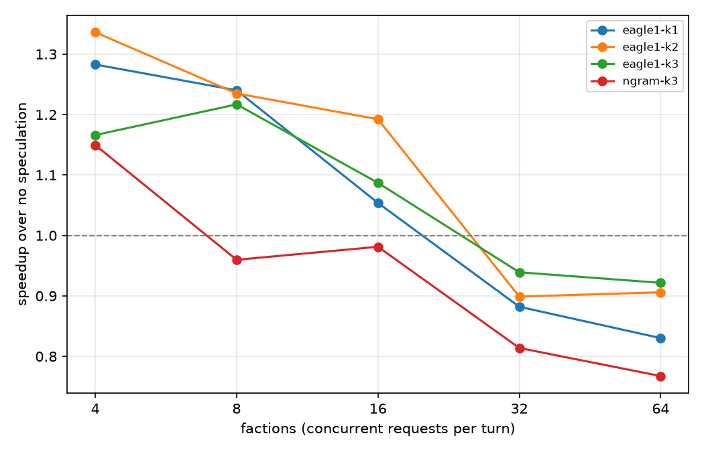
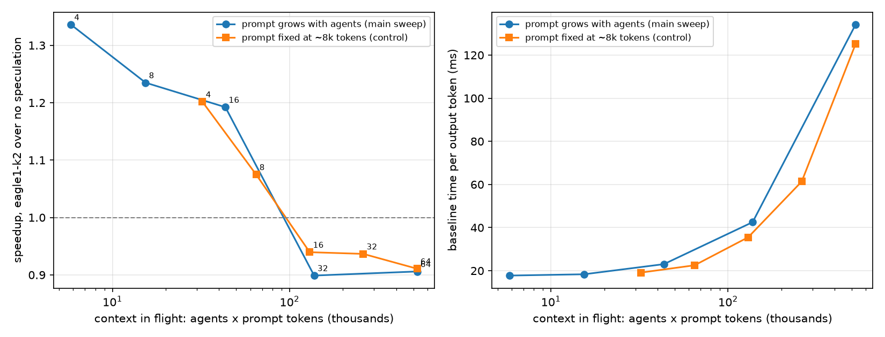

# speculative-statecraft

Does a draft head trained on a workload's own outputs beat generic speculative decoding, and at
what load does speculation stop paying?

This repo answers that on the workload from
[statecraft-serving](https://github.com/GIO443/statecraft-serving): a strategy game where 4 to 64
LLM factions each emit one guided-JSON decision per turn, plus a streamed narrator, served by
vLLM on one 8 GB laptop GPU. We collect the target model's own outputs, train an EAGLE-1 draft
head on them (51.5M parameters, under an hour on the same laptop), and compare it with no
speculation and with n-gram speculation across faction counts. The head's serving acceptance
is predicted offline before it is served, and the prediction lands within 3% of what vLLM
measures at every load (finding 7).

Companion repo: [statecraft-serving](https://github.com/GIO443/statecraft-serving) (the
simulation, the benchmark harness, and the non-speculative serving results).



## Findings (Qwen2.5-1.5B-Instruct, bf16, RTX 4070 Laptop 8 GB, vLLM 0.30.0)

Seconds per world turn, mean ± standard deviation over 3 seeded games (5 timed turns each), on
seeds the head never saw in training, with speedup over no speculation in brackets. k is the
number of draft tokens per step.

| Factions | no speculation | our head k=1 | our head k=2 | our head k=3 | n-gram k=3 |
|---|---|---|---|---|---|
| 4 | 3.63 ± 0.08 | 2.83 ± 0.11 (1.28x) | 2.72 ± 0.23 (**1.34x**) | 3.11 ± 0.43 (1.17x) | 3.16 ± 0.35 (1.15x) |
| 8 | 4.34 ± 0.23 | 3.50 ± 0.38 (1.24x) | 3.51 ± 0.38 (1.23x) | 3.57 ± 0.16 (1.22x) | 4.52 ± 0.31 (0.96x) ~ |
| 16 | 5.22 ± 0.33 | 4.95 ± 0.09 (1.05x) ~ | 4.38 ± 0.19 (**1.19x**) | 4.80 ± 0.23 (1.09x) ~ | 5.32 ± 0.55 (0.98x) ~ |
| 32 | 6.70 ± 0.35 | 7.59 ± 0.19 (0.88x) | 7.45 ± 0.33 (0.90x) | 7.13 ± 0.14 (0.94x) | 8.23 ± 0.12 (0.81x) |
| 64 | 15.06 ± 0.12 | 18.14 ± 1.23 (0.83x) | 16.63 ± 0.40 (0.91x) | 16.34 ± 0.19 (0.92x) | 19.63 ± 0.62 (0.77x) |

`~` marks a difference from no speculation within two standard errors (n = 3), not claimed as a
finding. Differences *between* our k values at 4 and 8 factions are also within noise: k=2
looking better than k=3 at 4 factions is not established, although it is the expected
direction, since the third draft position is accepted only 32% of the time there.

**The narrator's token cap does not drive the speedups.** The streamed narrator hits its cap
in 0-100% of turns depending on config, so the comparisons were recomputed on the
faction-decision phase alone (narrator excluded):
- *Our head:* k=2 still wins up to 16 agents (1.50 / 1.17 / 1.09x at 4 / 8 / 16) and loses
  from 32 (0.89x), so the crossover is unchanged.
- *N-gram:* its only win (1.15x at 4 factions) disappears (0.94x). All of it came from the
  narrator, which reuses phrasing from the earlier narrations in its prompt (2.6% of
  narrations are verbatim copies), exactly what prompt lookup catches.

**1. The workload-trained head beats generic speculation on its workload, and only there.**
In vLLM, the head's mean acceptance length at k=3 (accepted draft tokens + 1 per step) is 2.38
at 4 factions, rising to 2.89 at 32 and 64. N-gram falls from 2.32 to 2.17. Bigger games are
mostly faction JSON, which the head predicts very well. N-gram can only copy spans that already
appear in the prompt, and most JSON values and all message text are new.

The same head served on other request mixes shows the advantage is learned, not generic
(k=3, mean acceptance length, [micro-benchmark](results/microbench/step-cost/20261009T063640Z/summary.md)):

| Workload | our head | n-gram |
|---|---|---|
| The game (held-out turn) | **3.05** | 1.89 |
| A different JSON schema (support-ticket extraction) | 1.34 | **2.15** |
| Free prose | 1.20 | 1.22 |

On another schema the head falls to near-prose levels and loses to n-gram, which copies names
and order numbers straight from the ticket. *A workload-trained drafter is a bet on the
workload staying the same.*

**2. What the head can predict depends on the output region.** Offline, on held-out games:

| Region | mean acceptance length (k=3) | per-position acceptance |
|---|---|---|
| JSON scaffolding (keys, punctuation, action fields) | 3.58 | 0.94 / 0.88 / 0.76 |
| `diplomatic_message` free text | 1.97 | 0.50 / 0.28 / 0.19 |
| Narrator prose | 1.87 | 0.55 / 0.22 / 0.10 |

Structure the target has to emit is nearly free to draft; free text costs the head the same as
it costs any small drafter. *Workloads that are mostly structured output gain the most.*

**3. Speculation stops paying at ~65-130k tokens of context in flight (here, 16-32 agents).**
Below that, decode is memory-bandwidth bound: each step streams the 3 GB of weights to produce
one token per request, and the GPU's compute sits mostly idle. Verifying 2-4 tokens per step
uses that idle compute, so per-token latency falls (17.8 ms to 9.7 ms at 4 factions with
k=3). The loss at higher load is entirely in decoding: there were no preemptions, KV usage
peaked at 87%, and time to first token is unchanged. At 64 factions a plain decode step takes
~134 ms; with speculation on it takes ~326 ms at k=1 and ~384 ms at k=3.

Prompt length grows with faction count (1.35k to 7.9k tokens), so a control run fixed every
prompt at ~8k tokens (64-faction world) and varied only how many factions act. With long
prompts everywhere, the crossover moves down, from between 16 and 32 agents to between 8 and
16. Both runs fall on one curve when plotted against **context in flight** (agents x prompt
tokens): speculation pays below ~65k tokens in flight and loses above ~130k (right panel:
baseline per-token latency on the same axis).



**4. The crossover is mostly a property of the attention backend, not of compute
saturation.** A controlled micro-benchmark ([spec/microbench.py](spec/microbench.py)) isolates
one decode step. It replays a held-out 32-faction turn (~4.3k-token prompts) at fixed batch
sizes and times steps from the streamed output. Each candidate cause was tested directly:

| Candidate cause of the ~2.5x step cost | Test | Verdict |
|---|---|---|
| Draft model compute | n-gram k=1 (drafts on CPU) vs always-rejected random head | n-gram costs the same (66.9 vs 68.1 ms): **not draft compute** |
| JSON grammar checking draft tokens | guided vs unguided | 69.6 vs 66.9 ms with n-gram: **not the grammar** |
| Spec path falling back to eager mode | `--cudagraph-metrics` | decode steps run as FULL CUDA graphs: **no fallback** |
| Per-request overhead (sampling, rejection) | same batch with ~150-token prompts | only +6.9 ms at batch 32 |
| Attention over the context while verifying | ~4.3k- vs ~150-token prompts | +45 ms vs +7 ms: **scales with context** |

At batch 32, a verifying step on vLLM 0.30's default FlashAttention backend breaks down as:
- *Plain decode step:* 26.3 ms.
- *Per-request speculation overhead:* +6.9 ms.
- *Attention over the context with 2 query tokens per request:* +38 ms.
- *Draft head forward:* +2-4 ms.

The attention term should be small, since 2 queries read the same KV as 1, and on other
backends it is. Same test (batch 32, n-gram k=1):

| Attention backend | plain step | verifying step | ratio |
|---|---|---|---|
| FlashAttention (vLLM 0.30 default, used in every sweep) | 24.5 ms | 67.2 ms | **2.74x** |
| FlashInfer | 20.3 ms | 29.8 ms | 1.46x |
| Triton | 23.1 ms | 28.9 ms | 1.25x |

So most of the high-load penalty is the default backend's multi-query decode path, which gets
more expensive as context grows. FlashInfer is also the fastest backend without speculation
here. A sweep with FlashInfer or Triton should move the crossover to much higher load; that
rerun is the next experiment. The micro-benchmark ran at 0.70 GPU-memory utilization,
`max_model_len` 8192 and CUDA graphs up to 128 tokens (all servers alike), because only ~5.8
GiB of VRAM was free that day ([configs](configs/microbench/)).

*Practical rule: before concluding that speculation does not pay under load, check the
attention backend's verification path.*

**5. On 8 GB, speculation costs KV capacity, and only a very small drafter can afford it.** At
the same 0.8 GPU-memory setting, the KV cache available to the target shrinks from 1.93 GiB to
1.35-1.56 GiB when speculation is on. That memory goes to a larger CUDA graph pool, which vLLM
over-estimates by ~0.2 GiB, and to the drafter. Our head takes only 0.10 GiB of weights plus
one layer of KV, small enough that the capacity given up never became binding (peak KV usage
0.87, no preemptions). A generic small draft model does not fit at all. Qwen2.5-0.5B as a
`draft_model` adds 0.92 GiB of weights and its own 24-layer KV, leaving 0.30 GiB of cache when
one 16k-token request needs 0.62 GiB, so vLLM refuses to start
([config](configs/experiments/spec-smoke-draft.yaml)). We found no usable public EAGLE head for
Qwen2.5-1.5B-Instruct, so a 1-layer head trained in-house is the only model-based drafter that
fits.

**6. Guided decoding makes the model emit token sequences that re-tokenizing will not
reproduce.** Under the JSON grammar the model often emits `"},"` as two tokens, where the
tokenizer would use one. 15% of collected requests contain such a split. Training on
re-tokenized text would teach the head token sequences the model never produces, so the data
is collected with vLLM's sampled token ids (`return_token_ids`) instead.

**7. Measure acceptance the way vLLM drafts, or the offline number misleads.** Averaging over
every position overstates serving acceptance (3.02 for the final head, against 2.72 per draft):
a draft only starts where the previous one ended, so long accepted JSON runs skip the easy
positions. An offline metric that walks each sequence the same way predicts vLLM's measured
acceptance (k=3, from the sweep above) to within 3% at every faction count:

| Factions | 4 | 8 | 16 | 32 | 64 |
|---|---|---|---|---|---|
| vLLM | 2.38 | 2.56 | 2.72 | 2.89 | 2.89 |
| offline walk | 2.41 | 2.59 | 2.70 | 2.88 | 2.82 |

Because the logged tokens were sampled from the target's own guided, temperature-0.7
distribution, "greedy draft equals logged token" happens exactly as often as vLLM's rejection
sampler would accept that draft. That makes the offline estimate unbiased, and heads can be
compared in minutes without a serving sweep.

**Also measured:**
- *Collection:* 150 games, 20,400 requests, 0 errors.
- *Shared-prefix dedupe:* within a turn every request starts with the same tokens, and so the
  same target hidden states. Storing them once per turn cut storage 8x (89.6M to 11.1M tokens,
  32 GB) and target compute by the same factor. This is the same mechanism as prefix caching.
- *Sequence prefix:* the head's loss covers only completion tokens, so the sequence prefix
  contributes keys and values only. Queries and the MLP run at the ~60 completion positions
  instead of all 4-8k.
- *Narrator copying:* the narrator sometimes copies an earlier narration word for word from its
  prompt (2.6% of turns), which n-gram speculation catches for free.

## How it works

- `spec/collect.py`: plays seeded games through statecraft-serving's engine and logs, per
  request, the exact chat messages, completion text, and prompt and sampled token ids. Seeds
  used by the benchmarks are rejected, so evaluation games stay unseen.
- `spec/extract_hidden.py` (trainer container): target hidden states with transformers. Each
  turn's common prefix runs once and its KV cache is reused for every request in the turn.
  Output is one safetensors shard per game in a Docker volume.
- `spec/draft_head.py`: EAGLE-1 written to match vLLM's `EagleLlamaForCausalLM` exactly:
  `fc(cat(embed(x_{i+1}), f_i))`, one Llama decoder layer without input norm, no final norm,
  and the target's tied embedding as LM head. Tests check it against HF's Llama layer.
- `spec/train.py`: smooth-L1 feature regression plus cross-entropy against the target's own
  next-token distribution, at completion positions only. Validation holds out 10% of games by
  seed. The evaluation chains draft steps exactly as vLLM does: own feature fed back, attending
  to target keys up to the anchor plus earlier draft keys.
- `spec/export.py`: `config.json` + `model.safetensors` with only the head's own weights. vLLM
  shares the target's embedding and LM head.
- `analysis/phase4.py`: speedup, per-faction-count acceptance from vLLM counters, KV size, plots.
- `spec/microbench.py`: replays one recorded game turn at fixed batch sizes against several
  server configs and times decode steps from the streamed output: the median gap between
  chunks while every request is decoding. vLLM's own per-iteration time only covers the
  scheduler call under async scheduling. Also measures acceptance on other workloads.
- The serving sweep reuses statecraft-serving's harness (same container lifecycle, metrics and
  WSL2 caveat), so the baseline is directly comparable with Phase 1 there.

## Reproduce

Requirements: as for statecraft-serving (Windows, Docker Desktop with WSL2, NVIDIA GPU, uv,
Qwen2.5-1.5B-Instruct in the `hf-cache` volume), with this repo cloned next to it. GPU steps
must run one at a time.

```powershell
uv sync; uv run pytest                                                   # no GPU needed
uv run python -m spec.collect configs/collect/qwen2.5-1.5b.yaml          # ~2 h, serves vLLM
docker compose --profile train run --rm trainer `
  python3 -m spec.extract_hidden data/collect/qwen2.5-1.5b/<run> --out /data/hidden/qwen2.5-1.5b/<run>   # ~40 min
docker compose --profile train run --rm trainer `
  python3 -m spec.train configs/train/eagle1-qwen2.5-1.5b-6ep.yaml       # ~55 min, exports to /data/heads
uv run python -m bench.harness configs/experiments/phase4-1.5b.yaml --results-dir results   # ~2 h
uv run python -m analysis.phase4 results/phase4-1.5b/<timestamp>
```

Set the head path in `phase4-1.5b.yaml` to the exported head, and `hidden_dir` in the training
config to the extraction output. Container-only tests: `docker run --rm -v "${PWD}:/work" -w /work
speculative-statecraft-trainer python3 -m pytest tests/container`.

## Known limits

- **Hardware:** one model on one laptop GPU under WSL2 / Docker Desktop, so absolute numbers
  will differ elsewhere.
- **Fairness of the comparison:** the head was trained and evaluated on the same game with
  different seeds. That is the point of a workload-trained head, but it says nothing about other
  workloads.
- **Fixed settings:** speculation runs at the same 0.8 memory setting as the baseline, so its
  smaller KV cache counts against it rather than being compensated.
- **Session drift:** the same configuration rerun in a later session was 6-7% faster, so
  speedups are always within-run ratios.
- **Backend not yet swept:** the sweeps used vLLM 0.30's default FlashAttention backend, whose
  verification path causes most of the high-load penalty (finding 4). A sweep with FlashInfer
  or Triton has not been run yet.
- **Micro-benchmark settings:** it ran at reduced memory settings (finding 4), so its absolute
  step times are not comparable with the sweeps; only its within-run comparisons are used.
